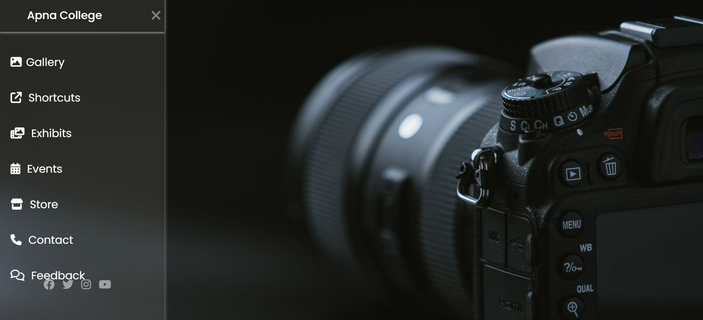

# Photography Sidebar UI

A modern photography website interface featuring an animated sidebar navigation menu built using HTML5 and CSS3.

## Features

- Animated sidebar navigation
- Responsive user interface
- Font Awesome icons
- Smooth CSS transitions
- Photography-themed landing page

## Technologies Used

- HTML5
- CSS3
- Font Awesome
- Google Fonts

## Project Structure

```
photography-sidebar-ui/
│
├── index.html
├── style.css
├── camera.jpg
└── README.md
```

## Author

Lasya Vanaparthi

## Preview


